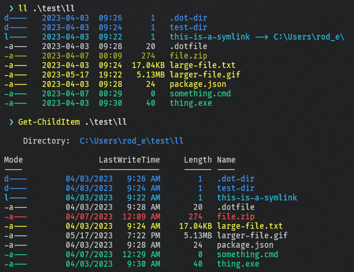
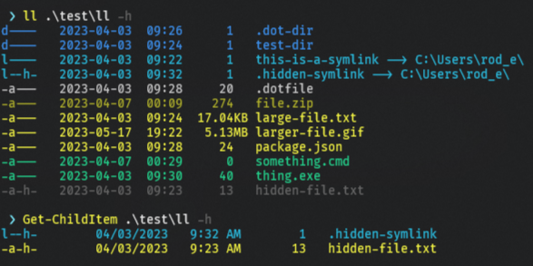

# better-pwsh-ls

A PowerShell module that displays a list of files and directories in a specified path with additional formatting and color-coding.

This module exports a function, `ll`, that provides an enhanced directory listing, similar to the `ls` command in Unix/Linux. It displays files and directories with additional details such as file attributes, last modified time, and file size. The output is color-coded to easily distinguish between different types of items, such as directories, hidden files, and symbolic links.

## Installation

This module can be installed from the [PowerShell Gallery](https://www.powershellgallery.com/packages/better-ls/) with the follwing command:

```pwsh
Install-Module -Name better-ls
```

## Usage
Once installed you can use this module by typing `ll` in your PowerShell terminal.

### Examples
See files and folders in current directory
```pwsh
PS> ll
```
Providing a path
```pwsh
PS> ll C:\Users\MyUser\
```
To see hidden files and folders
```pwsh
PS> ll C:\Users\MyUser\ -h
```

## Comparisons with `Get-ChildItem`

The output of `ll` is more compact, ordered by file type, and includes symlink destinations.


When viewing hidden files you still see the rest of the files in the directory with appropriate color coding.



